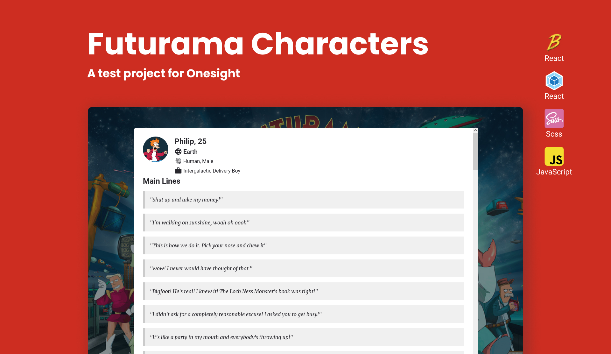
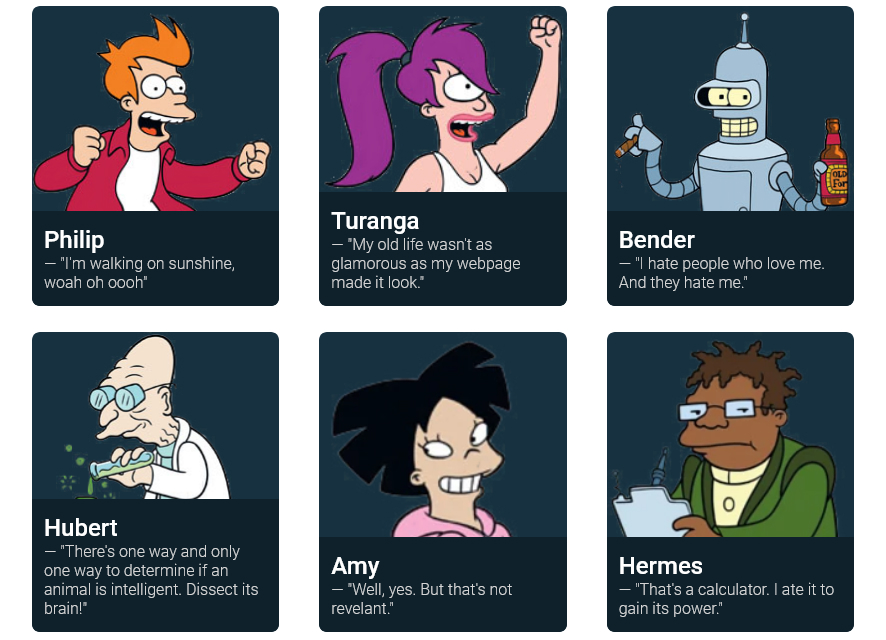

<p align="center">
  
</p>

# 💬 Project

Fruit of the first step in the selection process for Onesight's Frontend developer, this simple project load content from an external API and show a list of character and their sayings of the Futurama TV show.

<p align="center">
  
</p>

# 🚀 Getting started

## Prerequisites

To run the project locale you need to have `Node.js` installed.

---
## Running the project

Clone the project and access the folder.

```bash
  $ git clone https://github.com/BernardoHaab/Futurama-Characters.git
  $ cd Futurama-Characters
```

Install all dependencies and run the project.

```bash
  $ npm install
  $ npm run start
```

Now you can access the app on your browser at the http:://localhost:8080/

---

Whenever you want to stop the app, you can go back to your terminal and press <kbd>Ctrl</kbd> + <kbd>C</kbd>.

# 👨‍💻 Used Technologies

* <p style="line-height: 25px">
    <a style="text-decoration: none; color: white;" href="https://developer.mozilla.org/en-US/docs/Web/javascript">
      
      &emsp;JavaScript
    </a>
  </p>

* <p style="line-height: 25px">
    <a style="text-decoration: none; color: white;" href="https://sass-lang.com/">
      
      &emsp;Scss
    </a>
  </p>
* <p style="line-height: 25px">
    <a style="text-decoration: none; color: white;" href="https://webpack.js.org/">
      
      &emsp;Webpack
    </a>
  </p>
* <p style="line-height: 25px">
    <a style="text-decoration: none; color: white;" href="https://babeljs.io/">
      
      &emsp;Babel
    </a>
  </p>

# 💡 What I Learned

* **Webpack and Babel:** As much as I've been using Webpack and Babel with React, this is the first time I've set them up from scratch.
* **Js Classes:** Classes in JavaScript end up in a similar situation because, as much as I've used them during development with EmberJs, it's the first time I've developed for VanillaJs with them.


---
<p align="center">Made with 🖤 by Bernardo Haab</p>